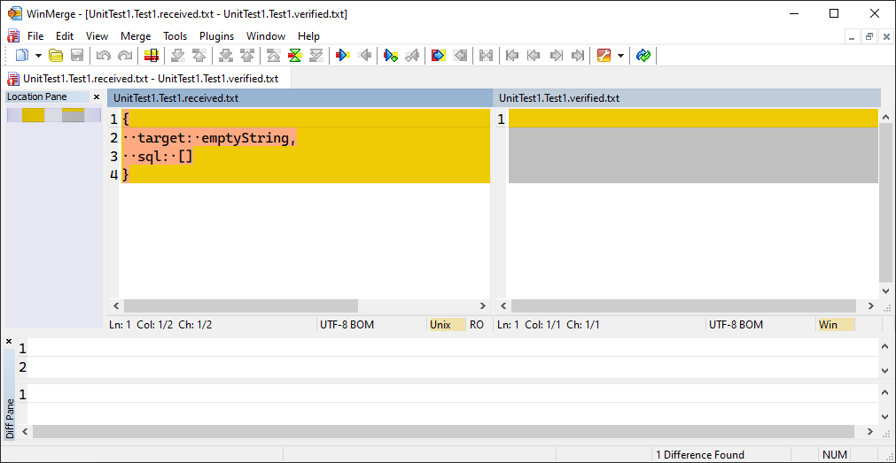

Simple CustomWebApplicationFactory example to reproduce a problem I'm having with [Verify.EntityFramework](https://github.com/VerifyTests/Verify.EntityFramework). See [this issue](https://github.com/VerifyTests/Verify.EntityFramework/issues/435). Probably something silly I'm doing wrong!

To use this example...

1. In the project root, run `docker-compose up` to create a sql server database.
1. Then run the single test in the test project.

The output looks like this...

